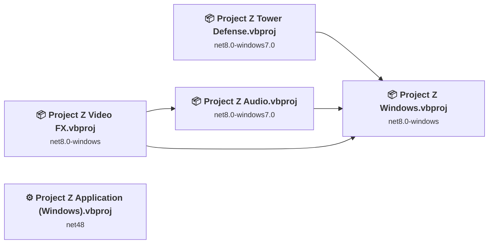
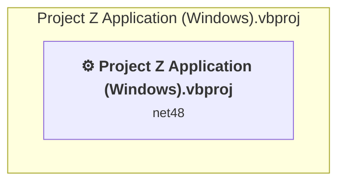
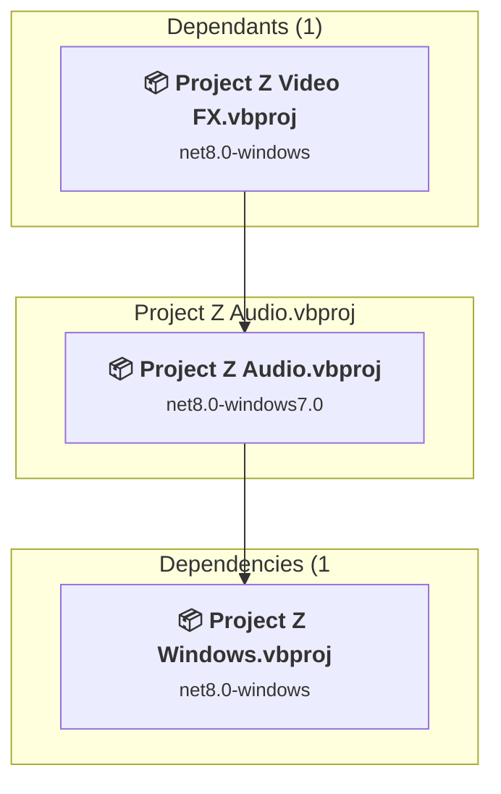
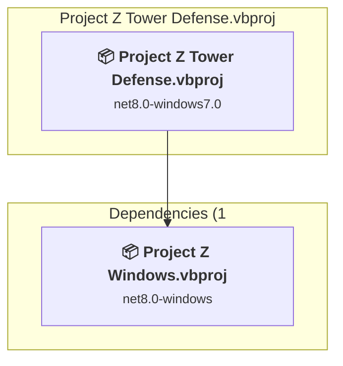
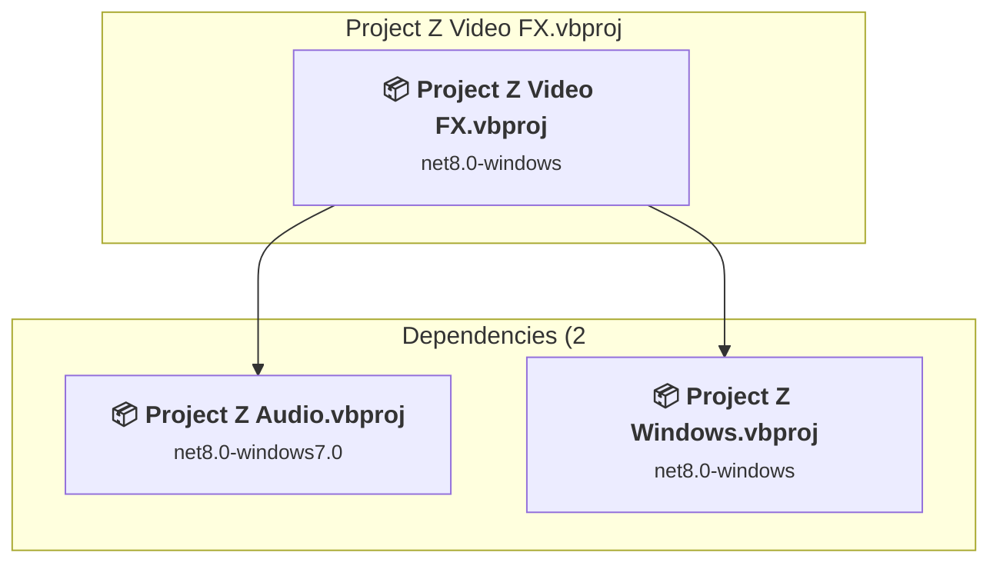
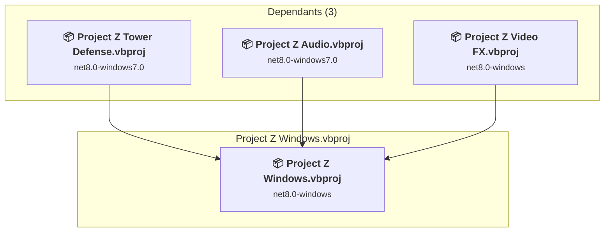

# Projects and dependencies analysis

This document provides a comprehensive overview of the projects and their dependencies in the context of upgrading to .NETCoreApp,Version=v8.0.

## Table of Contents

- [Executive Summary](#executive-Summary)
  - [Highlevel Metrics](#highlevel-metrics)
  - [Projects Compatibility](#projects-compatibility)
  - [Package Compatibility](#package-compatibility)
  - [API Compatibility](#api-compatibility)
- [Aggregate NuGet packages details](#aggregate-nuget-packages-details)
- [Top API Migration Challenges](#top-api-migration-challenges)
  - [Technologies and Features](#technologies-and-features)
  - [Most Frequent API Issues](#most-frequent-api-issues)
- [Projects Relationship Graph](#projects-relationship-graph)
- [Project Details](#project-details)

  - [Project Z Application\Project Z Application (Windows).vbproj](#project-z-applicationproject-z-application-(windows)vbproj)
  - [Project Z Audio\Project Z Audio.vbproj](#project-z-audioproject-z-audiovbproj)
  - [Project Z Tower Defense\Project Z Tower Defense.vbproj](#project-z-tower-defenseproject-z-tower-defensevbproj)
  - [Project Z Video FX\Project Z Video FX.vbproj](#project-z-video-fxproject-z-video-fxvbproj)
  - [Project Z Windows.vbproj](#project-z-windowsvbproj)

## Executive Summary

### Highlevel Metrics

| Metric | Count | Status |
| :--- | :---: | :--- |
| Total Projects | 5 | 1 require upgrade |
| Total NuGet Packages | 11 | All compatible |
| Total Code Files | 97 |  |
| Total Code Files with Incidents | 1 |  |
| Total Lines of Code | 17540 |  |
| Total Number of Issues | 2 |  |
| Estimated LOC to modify | 0+ | at least 0.0% of codebase |

### Projects Compatibility

| Project | Target Framework | Difficulty | Package Issues | API Issues | Est. LOC Impact | Description |
| :--- | :---: | :---: | :---: | :---: | :---: | :--- |
| [Project Z Application\Project Z Application (Windows).vbproj](#project-z-applicationproject-z-application-(windows)vbproj) | net48 | 🟢 Low | 0 | 0 |  | ClassicWinForms, Sdk Style = False |
| [Project Z Audio\Project Z Audio.vbproj](#project-z-audioproject-z-audiovbproj) | net8.0-windows7.0 | ✅ None | 0 | 0 |  | ClassLibrary, Sdk Style = True |
| [Project Z Tower Defense\Project Z Tower Defense.vbproj](#project-z-tower-defenseproject-z-tower-defensevbproj) | net8.0-windows7.0 | ✅ None | 0 | 0 |  | Wpf, Sdk Style = True |
| [Project Z Video FX\Project Z Video FX.vbproj](#project-z-video-fxproject-z-video-fxvbproj) | net8.0-windows | ✅ None | 0 | 0 |  | WinForms, Sdk Style = True |
| [Project Z Windows.vbproj](#project-z-windowsvbproj) | net8.0-windows | ✅ None | 0 | 0 |  | ClassLibrary, Sdk Style = True |

### Package Compatibility

| Status | Count | Percentage |
| :--- | :---: | :---: |
| ✅ Compatible | 11 | 100.0% |
| ⚠️ Incompatible | 0 | 0.0% |
| 🔄 Upgrade Recommended | 0 | 0.0% |
| ***Total NuGet Packages*** | ***11*** | ***100%*** |

### API Compatibility

| Category | Count | Impact |
| :--- | :---: | :--- |
| 🔴 Binary Incompatible | 0 | High - Require code changes |
| 🟡 Source Incompatible | 0 | Medium - Needs re-compilation and potential conflicting API error fixing |
| 🔵 Behavioral change | 0 | Low - Behavioral changes that may require testing at runtime |
| ✅ Compatible | 0 |  |
| ***Total APIs Analyzed*** | ***0*** |  |

## Aggregate NuGet packages details

| Package | Current Version | Suggested Version | Projects | Description |
| :--- | :---: | :---: | :--- | :--- |
| nkast.Kni.Platform.SDL2.GL | 4.2.9001.1 |  | [Project Z Application (Windows).vbproj](#project-z-applicationproject-z-application-(windows)vbproj) [Project Z Audio.vbproj](#project-z-audioproject-z-audiovbproj) [Project Z Tower Defense.vbproj](#project-z-tower-defenseproject-z-tower-defensevbproj) [Project Z Video FX.vbproj](#project-z-video-fxproject-z-video-fxvbproj) [Project Z Windows.vbproj](#project-z-windowsvbproj) | ✅Compatible |
| nkast.Xna.Framework | 4.2.9001 |  | [Project Z Application (Windows).vbproj](#project-z-applicationproject-z-application-(windows)vbproj) | ✅Compatible |
| nkast.Xna.Framework.Audio | 4.2.9001 |  | [Project Z Application (Windows).vbproj](#project-z-applicationproject-z-application-(windows)vbproj) | ✅Compatible |
| nkast.Xna.Framework.Content | 4.2.9001 |  | [Project Z Application (Windows).vbproj](#project-z-applicationproject-z-application-(windows)vbproj) | ✅Compatible |
| nkast.Xna.Framework.Game | 4.2.9001 |  | [Project Z Application (Windows).vbproj](#project-z-applicationproject-z-application-(windows)vbproj) | ✅Compatible |
| nkast.Xna.Framework.Graphics | 4.2.9001 |  | [Project Z Application (Windows).vbproj](#project-z-applicationproject-z-application-(windows)vbproj) [Project Z Windows.vbproj](#project-z-windowsvbproj) | ✅Compatible |
| nkast.Xna.Framework.Input | 4.2.9001 |  | [Project Z Application (Windows).vbproj](#project-z-applicationproject-z-application-(windows)vbproj) | ✅Compatible |
| nkast.Xna.Framework.Media | 4.2.9001 |  | [Project Z Application (Windows).vbproj](#project-z-applicationproject-z-application-(windows)vbproj) | ✅Compatible |
| SocketJack | 1.2.3 |  | [Project Z Windows.vbproj](#project-z-windowsvbproj) | ✅Compatible |
| SocketJack | 1.3.0 |  | [Project Z Tower Defense.vbproj](#project-z-tower-defenseproject-z-tower-defensevbproj) | ✅Compatible |
| Speckle.Triangle | 1.0.0 |  | [Project Z Application (Windows).vbproj](#project-z-applicationproject-z-application-(windows)vbproj) [Project Z Audio.vbproj](#project-z-audioproject-z-audiovbproj) [Project Z Tower Defense.vbproj](#project-z-tower-defenseproject-z-tower-defensevbproj) [Project Z Video FX.vbproj](#project-z-video-fxproject-z-video-fxvbproj) [Project Z Windows.vbproj](#project-z-windowsvbproj) | ✅Compatible |

## Top API Migration Challenges

### Technologies and Features

| Technology | Issues | Percentage | Migration Path |
| :--- | :---: | :---: | :--- |

### Most Frequent API Issues

| API | Count | Percentage | Category |
| :--- | :---: | :---: | :--- |

## Projects Relationship Graph

Legend:
📦 SDK-style project
⚙️ Classic project

## Project Details

### Project Z Application\Project Z Application (Windows).vbproj

#### Project Info

- **Current Target Framework:** net48
- **Proposed Target Framework:** net8.0-windows
- **SDK-style**: False
- **Project Kind:** ClassicWinForms
- **Dependencies**: 0
- **Dependants**: 0
- **Number of Files**: 19
- **Number of Files with Incidents**: 1
- **Lines of Code**: 1079
- **Estimated LOC to modify**: 0+ (at least 0.0% of the project)

#### Dependency Graph

Legend:
📦 SDK-style project
⚙️ Classic project

### API Compatibility

| Category | Count | Impact |
| :--- | :---: | :--- |
| 🔴 Binary Incompatible | 0 | High - Require code changes |
| 🟡 Source Incompatible | 0 | Medium - Needs re-compilation and potential conflicting API error fixing |
| 🔵 Behavioral change | 0 | Low - Behavioral changes that may require testing at runtime |
| ✅ Compatible | 0 |  |
| ***Total APIs Analyzed*** | ***0*** |  |

### Project Z Audio\Project Z Audio.vbproj

#### Project Info

- **Current Target Framework:** net8.0-windows7.0✅
- **SDK-style**: True
- **Project Kind:** ClassLibrary
- **Dependencies**: 1
- **Dependants**: 1
- **Number of Files**: 10
- **Lines of Code**: 1652
- **Estimated LOC to modify**: 0+ (at least 0.0% of the project)

#### Dependency Graph

Legend:
📦 SDK-style project
⚙️ Classic project

### API Compatibility

| Category | Count | Impact |
| :--- | :---: | :--- |
| 🔴 Binary Incompatible | 0 | High - Require code changes |
| 🟡 Source Incompatible | 0 | Medium - Needs re-compilation and potential conflicting API error fixing |
| 🔵 Behavioral change | 0 | Low - Behavioral changes that may require testing at runtime |
| ✅ Compatible | 0 |  |
| ***Total APIs Analyzed*** | ***0*** |  |

### Project Z Tower Defense\Project Z Tower Defense.vbproj

#### Project Info

- **Current Target Framework:** net8.0-windows7.0✅
- **SDK-style**: True
- **Project Kind:** Wpf
- **Dependencies**: 1
- **Dependants**: 0
- **Number of Files**: 20
- **Lines of Code**: 3232
- **Estimated LOC to modify**: 0+ (at least 0.0% of the project)

#### Dependency Graph

Legend:
📦 SDK-style project
⚙️ Classic project

### API Compatibility

| Category | Count | Impact |
| :--- | :---: | :--- |
| 🔴 Binary Incompatible | 0 | High - Require code changes |
| 🟡 Source Incompatible | 0 | Medium - Needs re-compilation and potential conflicting API error fixing |
| 🔵 Behavioral change | 0 | Low - Behavioral changes that may require testing at runtime |
| ✅ Compatible | 0 |  |
| ***Total APIs Analyzed*** | ***0*** |  |

### Project Z Video FX\Project Z Video FX.vbproj

#### Project Info

- **Current Target Framework:** net8.0-windows✅
- **SDK-style**: True
- **Project Kind:** WinForms
- **Dependencies**: 2
- **Dependants**: 0
- **Number of Files**: 13
- **Lines of Code**: 536
- **Estimated LOC to modify**: 0+ (at least 0.0% of the project)

#### Dependency Graph

Legend:
📦 SDK-style project
⚙️ Classic project

### API Compatibility

| Category | Count | Impact |
| :--- | :---: | :--- |
| 🔴 Binary Incompatible | 0 | High - Require code changes |
| 🟡 Source Incompatible | 0 | Medium - Needs re-compilation and potential conflicting API error fixing |
| 🔵 Behavioral change | 0 | Low - Behavioral changes that may require testing at runtime |
| ✅ Compatible | 0 |  |
| ***Total APIs Analyzed*** | ***0*** |  |

### Project Z Windows.vbproj

#### Project Info

- **Current Target Framework:** net8.0-windows✅
- **SDK-style**: True
- **Project Kind:** ClassLibrary
- **Dependencies**: 0
- **Dependants**: 3
- **Number of Files**: 65
- **Lines of Code**: 11041
- **Estimated LOC to modify**: 0+ (at least 0.0% of the project)

#### Dependency Graph

Legend:
📦 SDK-style project
⚙️ Classic project

### API Compatibility

| Category | Count | Impact |
| :--- | :---: | :--- |
| 🔴 Binary Incompatible | 0 | High - Require code changes |
| 🟡 Source Incompatible | 0 | Medium - Needs re-compilation and potential conflicting API error fixing |
| 🔵 Behavioral change | 0 | Low - Behavioral changes that may require testing at runtime |
| ✅ Compatible | 0 |  |
| ***Total APIs Analyzed*** | ***0*** |  |

